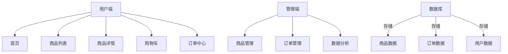
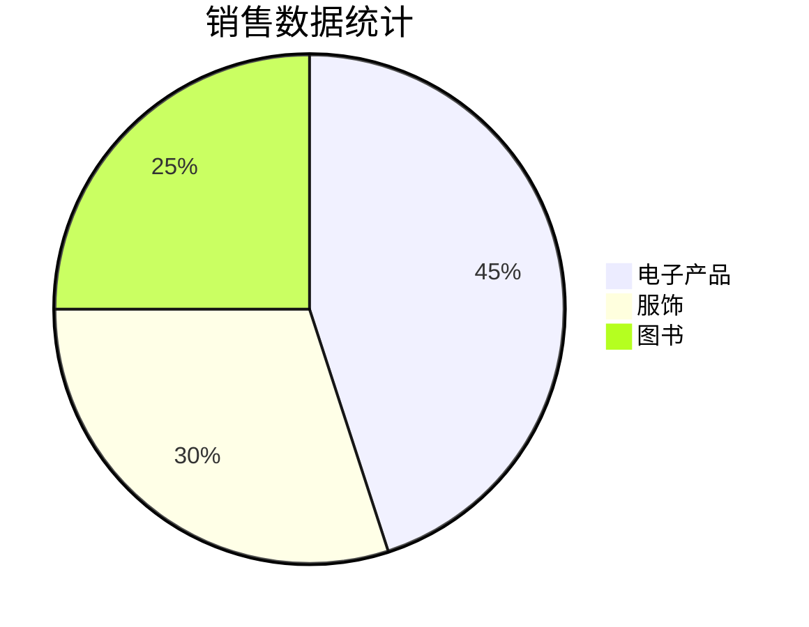

# 东软网上商城 - 基于Vue.js的购物网站实验项目

## 项目概述
**广东东软学院Web前端开发技术课程实验项目**  
模仿主流电商平台实现核心购物流程，包含商品展示、购物车管理、订单处理等模块，采用Vue.js框架实现响应式交互。

---

## 技术栈
### 核心框架
- **Vue 3** + Vue Router + Vuex
- **Element Plus** UI组件库
- **Axios** 数据请求
- **Lodash** 工具库

### UI与样式系统
- **CSS变量系统** - 统一主题管理
  - 色彩变量 (主题色、灰度色阶)
  - 阴影层级系统 (shadow-sm, shadow-md, shadow-lg)
  - 过渡效果变量 (transition-fast, transition-normal, transition-slow)
  - 边框圆角变量 (border-radius)
- **动画效果**
  - 闪光效果 (shine-effect) - 卡片悬停时光泽扫过效果
  - 波纹效果 (ripple-btn) - 按钮点击水波纹动画
  - 图片缩放 (img-hover-zoom) - 图片悬停放大效果
  - 脉冲动画 - 用于库存警告和加载指示器
- **响应式布局**
  - 媒体查询适配不同屏幕尺寸
  - Flexbox弹性布局

### 拓展技术（加分项）
- 后端：Node.js + Express
- 数据库：Mysql

---

## 系统架构


---

## 功能实现

### 1. 商品模块
```javascript
// 商品数据示例
{
  id: "P001",
  name: "无线蓝牙耳机",
  price: 299,
  stock: 50,
  category: "电子产品",
  images: ["/img/earphone.jpg"]
}
```
- **展示逻辑**  
  - 瀑布流布局 + 图片懒加载
  - 价格排序过滤器
  - 商品卡片动画效果和交互
  ```vue
  <template>
    <el-card v-for="product in filteredProducts" 
             :key="product.id"
             class="product-card shine-effect">
      <div class="image-container img-hover-zoom">
        
        <div class="product-overlay">
          <span class="view-details">查看详情</span>
        </div>
        <div class="product-badge" v-if="isNew">新品</div>
        <div class="product-badge sold-out" v-if="product.stock <= 0">售罄</div>
      </div>
      <div class="product-info">
        <div class="product-name">{{ product.name }}</div>
        <div class="product-price">¥{{ product.price }}</div>
      </div>
    </el-card>
  </template>
  ```

### 2. 购物车模块
**Vuex状态管理实现**  
```javascript
// store/cart.js
export default {
  state: {
    items: JSON.parse(localStorage.getItem('cart')) || []
  },
  mutations: {
    ADD_TO_CART(state, product) {
      const existing = state.items.find(item => item.id === product.id)
      existing ? existing.quantity++ : state.items.push({...product, quantity: 1})
      localStorage.setItem('cart', JSON.stringify(state.items))
    }
  }
}
```

### 3. 订单系统
**核心业务流程**  
1. 购物车选择 → 2. 地址填写 → 3. 支付模拟 → 4. 订单生成  
```vue
<!-- 订单提交组件 -->
<template>
  <el-steps :active="step">
    <el-step title="确认订单"></el-step>
    <el-step title="支付"></el-step>
    <el-step title="完成"></el-step>
  </el-steps>
</template>
```

### 4. 用户界面
**登录/注册系统**
- 模态对话框表单
- 表单验证
- 用户头像和下拉菜单

---

## 创新设计与优化
### 1. 智能搜索
- 防抖处理搜索请求
- 关键词高亮显示
```javascript
// 实现防抖搜索
const search = _.debounce(keyword => {
  axios.get(`/api/search?q=${keyword}`)
}, 500)
```

### 2. 性能优化
- ResizeObserver循环错误修复
```javascript
// 重写ResizeObserver构造函数防止循环通知错误
window.ResizeObserver = class ResizeObserver extends window.ResizeObserver {
  constructor(callback) {
    let timer = null;
    const debouncedCallback = function () {
      let context = this;
      let args = arguments;
      clearTimeout(timer);
      timer = setTimeout(function () {
        callback.apply(context, args);
      }, 16);
    };
    super(debouncedCallback);
  }
};
```

### 3. UI设计与样式
- **CSS变量系统** - 一致性设计系统
- **可复用组件** - ProductCard, Header等
- **动画与过渡效果** - 提升用户体验
- **响应式设计** - 适配各种屏幕尺寸
```css
/* 设计系统示例 */
:root {
  --primary-color: #4a6cf7;
  --primary-light: #6b89f8;
  --shadow-sm: 0 2px 8px rgba(0,0,0,0.05);
  --transition-normal: 0.3s;
  --border-radius: 10px;
}

/* 响应式布局 */
@media (max-width: 768px) {
  .product-grid {
    grid-template-columns: repeat(2, 1fr);
  }
  .product-actions {
    flex-direction: column;
    gap: 8px;
  }
}
```

### 4. 可视化后台


---

## 项目结构
```bash
src/
├─ api/            # 接口封装
├─ assets/         # 静态资源
│   └─ images/     # 图片资源
├─ components/     # 全局组件
│   ├─ Header.vue  # 网站头部导航
│   └─ ProductCard.vue # 商品卡片组件
├─ router/         # 路由配置
├─ store/          # Vuex模块
├─ views/          # 页面组件
│   ├─ Home.vue    # 首页
│   └─ Cart.vue    # 购物车页面
├─ App.vue         # 根组件(全局样式)
└─ main.js         # 入口文件
```

---

## 运行指南
```bash
# 安装依赖
npm install

# 启动开发服务器
npm run serve

# 构建生产版本
npm run build

# 代码检查
npm run lint
```

---

## 实验报告要点
### 系统截图
| 首页 | 商品详情 | 购物车 |
|------|----------|--------|
|  |  |  |

### 技术对比
| 方案 | 优点 | 缺点 |
|------|------|------|
| 本地存储 | 实现简单、无需后端 | 数据易丢失、安全性低 |
| 数据库 | 数据持久化、支持复杂查询 | 需要后端支持、部署复杂 |
| CSS变量 | 主题统一、易于维护 | IE兼容性问题 |
| Scss预处理器 | 嵌套语法、混合功能 | 需要编译步骤 |

### 问题解决
1. **跨域问题**  
   ```javascript
   // vue.config.js
   devServer: {
     proxy: 'http://localhost:3000'
   }
   ```
2. **状态持久化**  
   使用`localStorage`同步Vuex状态

3. **ResizeObserver循环错误**  
   重写ResizeObserver构造函数，使用防抖函数延迟回调执行

4. **图片加载错误处理**  
   ```javascript
   // 全局指令处理图片加载失败
   app.directive('img-fallback', {
     mounted(el) {
       el.addEventListener('error', () => {
         el.src = 'https://via.placeholder.com/200?text=No+Image';
       });
     }
   });
   ```

---

**开发者**：冯子谦（学号 22215120425）  
**最后更新**：2025-05-10